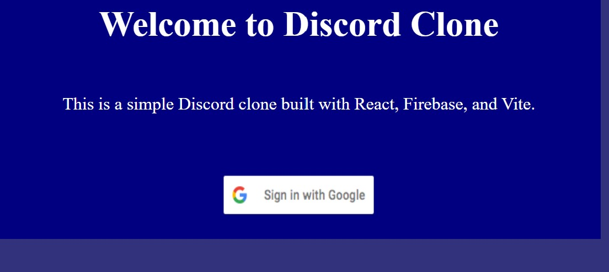
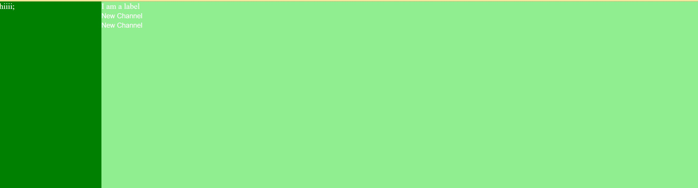
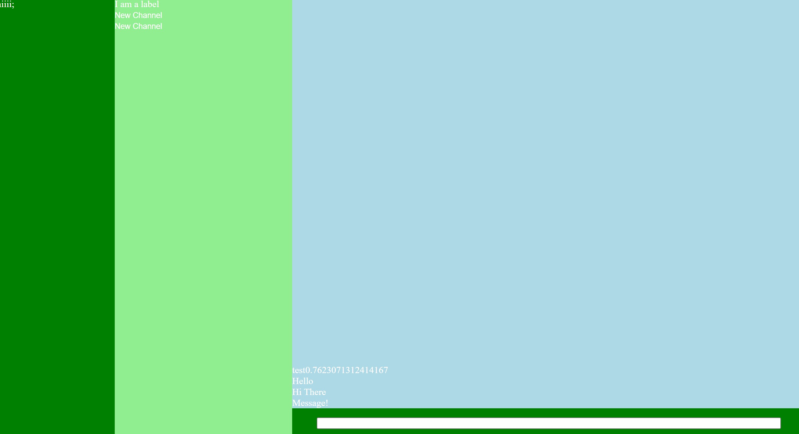

# Project 2 Proposal

# Project 2 WIP Check In

We started with a plan for the components, seeing what we needs to use and create. We wanted to use Firebase's Database, but we needed a good hierarchy to start with. We used our knowledge of Discord, and created one. 

Servers -> Server
                -> Category -> Channel
                                     -> Messages

Then we made a static repesentation of the App, and make a Firebase Account to set up. There was trouble with refactoring to components, so we decided to try a class based approach, with Servers, Categories/Channels, and Messages in that hierarchy. Gregory has a great computer science c/c++ background so he has set up those classes. I made a basic welcome screen, and found out that Google Authentification hasn't been consistent lately because of browsers updating to automatically block third party cookies, so we will have to find some other authentification. We are thinking of creating our own user / password system. 

Using Firestore Databases, we can use realtime updating databases to store messages and servers, and plan on integrating that fetching system, to save live messages and allow for us to search for servers. The Data we are needing to change is going to be Servers, as we can add or delete servers. This will include the rest of their children, the categories, channels, and messages. We can store all of these in arrays and update with State or Class objects. Since it is in Firebase, they will handle the realtime changes, and we can use UseEffect(), when a server is created, or when channels are created, or when messages or created to call the Firebase APIs.

I also plan to find a UI kit that we can use and customize for our components for a clear and good looking User Experience of the app, and to intorduce myself to these UI frameworks that work with React. We will not make an exact Discord clone, but make our own similar chatroom app and style it in our own way. 

## Pictures /Documentation
Welcome Page Version 1

App Page Version 1

ChatRoom Version 1

# Project 2 Reflection

# React + Vite

This template provides a minimal setup to get React working in Vite with HMR and some ESLint rules.

Currently, two official plugins are available:

- [@vitejs/plugin-react](https://github.com/vitejs/vite-plugin-react/blob/main/packages/plugin-react/README.md) uses [Babel](https://babeljs.io/) for Fast Refresh
- [@vitejs/plugin-react-swc](https://github.com/vitejs/vite-plugin-react-swc) uses [SWC](https://swc.rs/) for Fast Refresh
